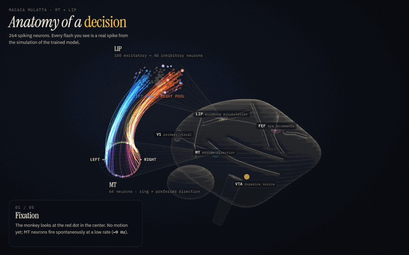
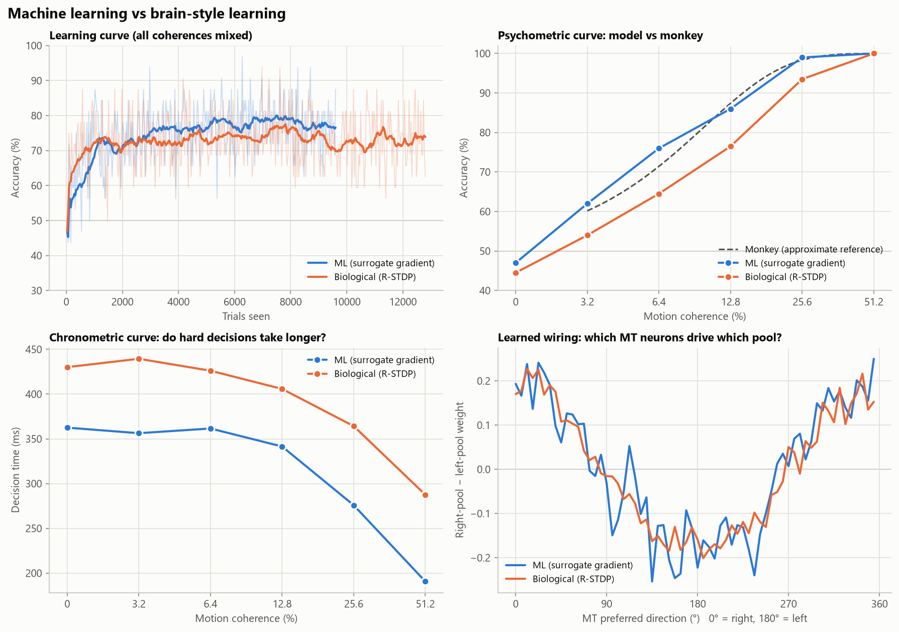
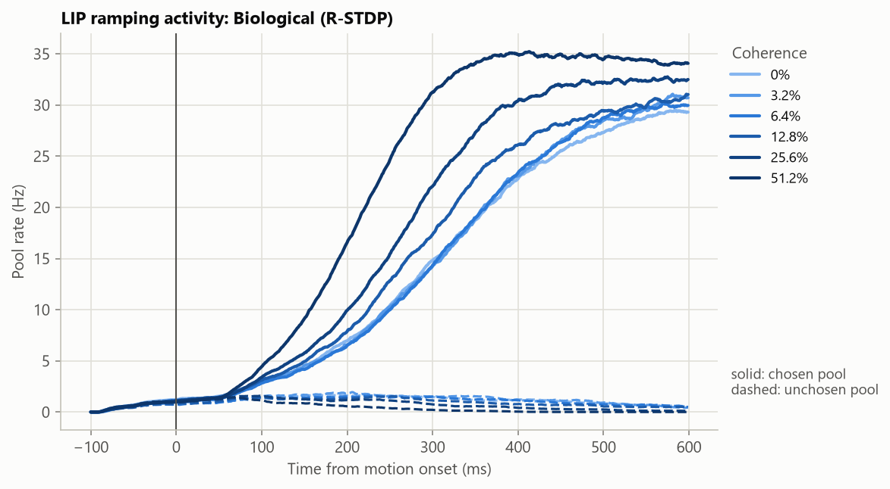
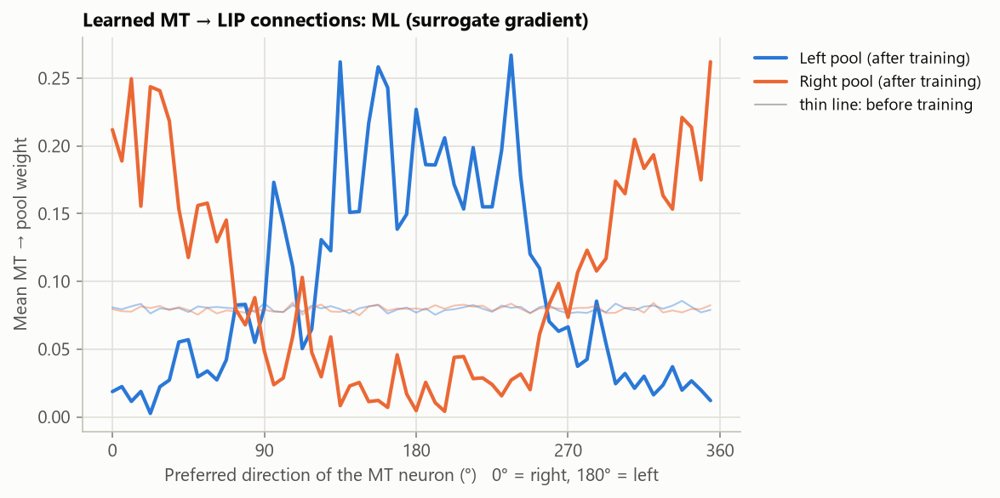
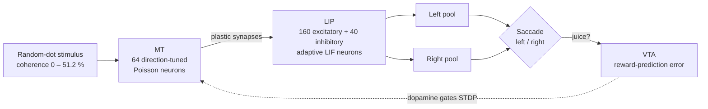
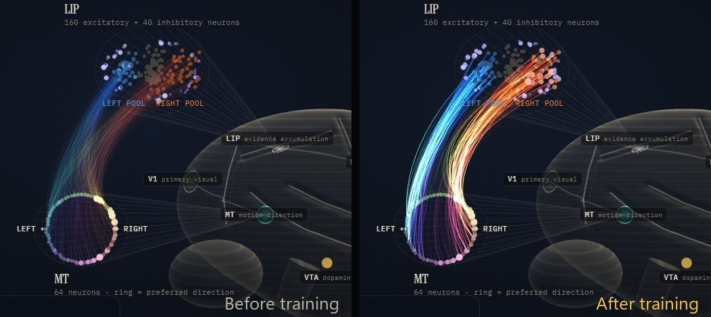
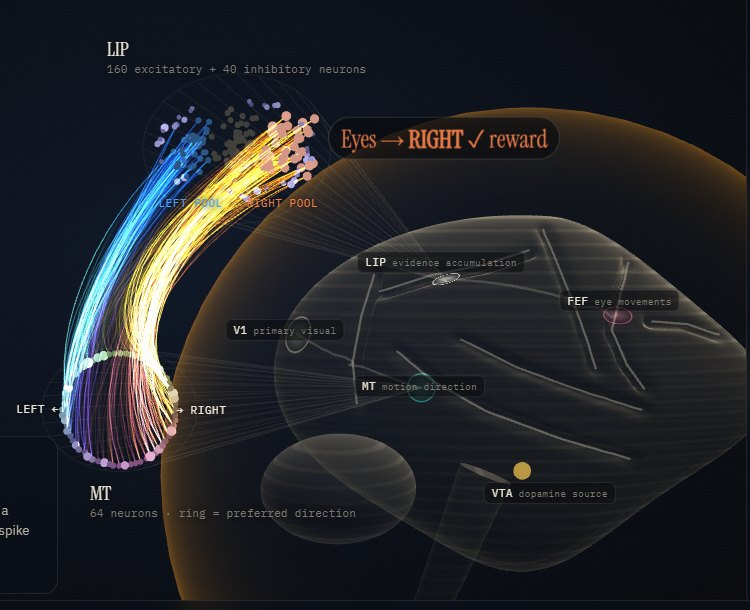
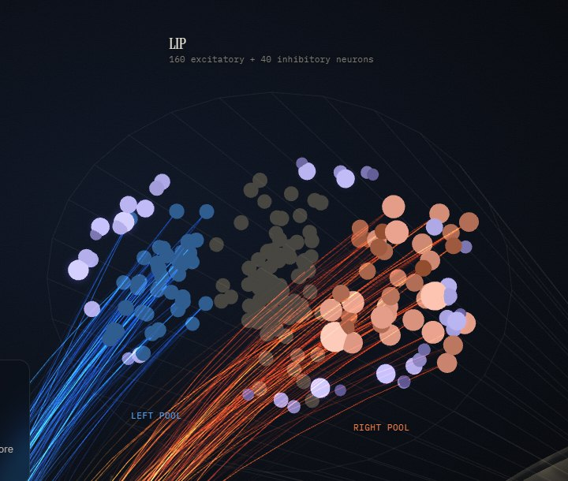
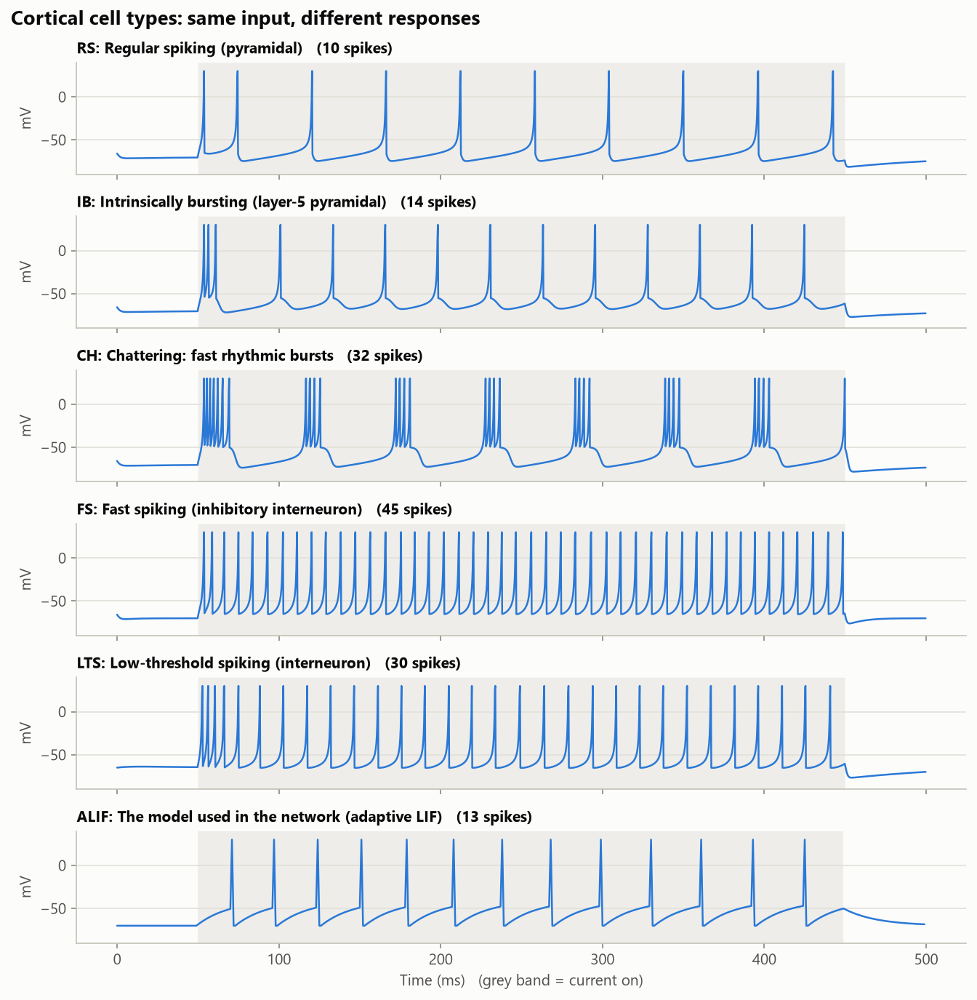

<div align="center">

# Anatomy of a Decision

**264 spiking neurons modeled on the macaque brain learn to see motion, make a choice, and learn from reward.**

[](https://ethyusuf.github.io/macaque-decision-snn/)

[](https://github.com/EthYusuf/macaque-decision-snn/actions/workflows/tests.yml)


[](LICENSE)

<a href="https://ethyusuf.github.io/macaque-decision-snn/"></a>

<sub>Every flash is a real spike from the trained network: motion-tuned MT neurons fire, spikes travel to LIP, two choice pools race, the eyes move right, and dopamine reinforces the synapses that did the work.</sub>

</div>

---

## What is this?

The **random-dot motion task** is the workhorse experiment of decision neuroscience. A monkey watches a cloud of moving dots and reports, with an eye movement, whether the motion is to the left or to the right. Work by Newsome, Shadlen and colleagues showed how this decision unfolds in the brain. Area **MT** encodes the direction of motion. Area **LIP** gradually accumulates that evidence until the monkey commits to a choice.

This project rebuilds that circuit as a **spiking neural network** with macaque-derived properties and teaches it the same task in two very different ways:

| | Machine learning | Brain-style learning |
|---|---|---|
| Rule | Surrogate-gradient backprop through time (BPTT) | Three-factor, dopamine-modulated STDP (R-STDP) |
| What it changes | Every synapse | Only the MT → LIP synapses |
| Credit signal | Exact gradient of a loss | Reward-prediction error from a VTA "critic" |
| Biologically plausible? | Probably not | Much closer |

Both models then go through **the same tests used on real monkeys**: psychometric and chronometric curves, and LIP firing-rate dynamics.

> **Honest note.** These are simulated neurons with properties taken from the macaque literature (time constants, E/I ratio, Dale's law, NMDA synapses, MT tuning). It is a scientifically grounded model, not recorded brain data, and the "monkey" curve shown below is an approximate reference, not a dataset.

## Highlights

- **Monkey-like perception.** The ML-trained network reaches a psychometric threshold of **9.4 % coherence**; macaques typically sit around 10 %.
- **LIP ramping emerges on its own.** Nobody told the network to ramp. Activity in the chosen pool rises faster for stronger evidence while the other pool is suppressed. This reproduces the signature finding of Roitman & Shadlen (2002).
- **One engine, two learning rules.** Both rules drive the *same* simulation code, so the comparison is fair.
- **Grounded in biology.** Adaptive LIF neurons, 80/20 E/I split, Dale's law enforced during training, saturating NMDA reverberation (Wang 2002), fixed in-degree wiring (Brunel 2000), and MT tuning from Britten et al. (1993).
- **Interactive 3D brain.** A Three.js page replays real spikes at six snapshots during training, so you can watch learning rewire the network. [Try it.](https://ethyusuf.github.io/macaque-decision-snn/)
- **Engineered like research software.** 22 unit tests, CI, pretrained models, deterministic seeds, and a single `monkeybrain` CLI.

## Results

<p align="center"></p>

| | ML (surrogate gradient) | Biological (R-STDP) | Macaque (approx.) |
|---|:---:|:---:|:---:|
| Accuracy at 12.8 % coherence | 86 % | 77 % | ~87 % |
| Accuracy at 51.2 % coherence | 100 % | 100 % | ~100 % |
| Psychometric threshold (Weibull α) | **9.4 %** | 15.3 % | ~10 % |
| Peak firing rate of the chosen LIP pool | 30 Hz | 42 Hz | ~60–70 Hz |
| Ramp steepens with coherence | ✔ | ✔ | ✔ |
| Harder decisions take longer | ✔ | ✔ | ✔ |

<p align="center">
  
  
</p>

**Reading the figures.** Left: the chosen pool ramps toward a plateau, reaching it sooner when the evidence is stronger. Right: before training every MT neuron talks equally to both pools (thin lines). After training, the right pool listens to right-preferring MT neurons and the left pool to left-preferring ones. The two learning rules independently discover the same cosine-shaped wiring.

## How it works



| Component | Model | Why |
|---|---|---|
| MT input | `r = r₀ + g·c(t)·cos(θ − θ_pref)`, Poisson spikes, frame-by-frame motion noise | MT rates rise linearly with coherence (Britten et al. 1993) |
| Neurons | Adaptive LIF, τ_m = 20 ms (E) / 10 ms (I), 2 ms refractory period | Pyramidal adaptation and fast-spiking interneurons |
| Synapses | AMPA/GABA τ = 5 ms; **saturating** NMDA τ = 100 ms on E→E | Slow reverberation integrates evidence and settles at a bounded rate (Wang 2002) |
| Wiring | 80/20 E/I, 20 % sparse, fixed in-degree, two self-exciting pools with shared inhibition | Winner-take-all competition without built-in bias |
| ML rule | Fast-sigmoid surrogate gradient, BPTT over 700 steps, cross-entropy + firing-rate penalty, Adam | Upper bound on what the circuit can learn (Neftci et al. 2019) |
| Bio rule | STDP eligibility trace (τ = 800 ms) × dopamine (reward − expected reward per difficulty), post-synaptic centering, synaptic scaling | Three-factor learning (Izhikevich 2007; Frémaux & Gerstner 2016; Legenstein et al. 2010) |

## Engineering notes: what broke and how it was fixed

These problems came up while building the model. Each fix is documented in the code and in the tutorial.

1. **The biological rule learned nothing (52 %).** Dopamine is broadcast to every synapse. Because the losing pool kept firing at a low rate, it shared credit for the winner's rewards, so both pools learned the *same* direction. **Fix:** use each neuron's deviation from its own mean activity (the EH rule, Legenstein et al. 2010) and strengthen winner-take-all competition so that the loser falls silent.
2. **A 95 % left bias at zero coherence.** With random (binomial) wiring, the pools differed by about 5 % in connection counts, and strong recurrence amplified that gap into a constant left choice. **Fix:** fixed in-degree connectivity (Brunel 2000), so every neuron receives exactly the same number of inputs from each population.
3. **Runaway firing at 113 Hz.** With linear NMDA currents, the winning pool kept climbing for the whole trial. **Fix:** saturating NMDA gating (`g ← g + κ(1 − g)` per spike) bounds recurrent excitation. The pool now settles near 40 Hz and its ramp converges to a common level, as LIP rates do at decision time.
4. **BPTT was 10× too slow.** Indexing a precomputed `(T, B, N)` tensor inside the time loop made autograd materialize a full-size zero tensor at every step on the backward pass. **Fix:** `unbind(0)`, which brought one training step down to about 1 s on a laptop CPU.
5. **A misleading reaction-time curve.** With a fixed high threshold, most hard trials never crossed it, so the averages came only from a few lucky trials (survivorship bias). **Fix:** use the highest threshold that at least 80 % of trials reach in every condition.

## Quickstart

```bash
git clone https://github.com/EthYusuf/macaque-decision-snn
cd macaque-decision-snn
pip install -e .
```

Pretrained models are included, so the analysis and 3D commands work immediately:

```bash
monkeybrain --lang en compare        # ML vs biological vs monkey, using the pretrained models
monkeybrain --lang en brain3d        # writes the interactive 3D page to outputs/
```

Explore the pipeline step by step:

```bash
monkeybrain --lang en neuron                 # five cortical cell types + the adaptive LIF used in the network
monkeybrain --lang en simulate               # the untrained network: spikes, but coin-flip choices
monkeybrain --lang en train --method ml      # surrogate gradients (~5 min on a laptop CPU, --quick for ~1 min)
monkeybrain --lang en train --method bio     # dopamine-modulated STDP (~5 min)
monkeybrain --lang en evaluate --method bio  # psychometric, chronometric, LIP ramp, weights
pytest                                       # 22 unit tests
```

Every run is saved to `outputs/<command>_<timestamp>/` with figures, `metrics.json` and a checkpoint. `--lang en` switches figures to English; console messages are in Turkish because the project started as a Turkish teaching project. The 3D page picks English or Turkish from the browser and accepts URL parameters such as `?method=ml&stage=0&t=450&pause&view=LIP`.

## Gallery

| | |
|---|---|
|  |  |
| **Learning rewires the network.** Same stimulus and same noise, before vs after training. | **Dopamine credit assignment.** After a rewarded trial, synapses with an eligibility trace light up. |
|  |  |
| **Inside LIP.** The right pool fires, the left pool is silenced by shared inhibition. | **Cell types.** Izhikevich models of cortical neurons next to the adaptive LIF used here. |

## Repository layout

```
monkeybrain/
├── config.py              every parameter, with its biological rationale
├── neurons.py             Izhikevich, adaptive LIF, surrogate spike function
├── task.py                random-dot task and MT population code
├── network.py             SpikingBrain: the shared MT → LIP simulation engine
├── learning/
│   ├── surrogate_trainer.py   ML rule (BPTT)
│   └── rstdp_trainer.py       biological rule (three-factor STDP)
├── analysis.py            psychometric / chronometric fits, PSTHs, weight selectivity
├── plots.py               all figures (Turkish / English)
├── export3d.py            real spike data for the 3D page
├── templates/brain3d.html interactive Three.js page
└── __main__.py            the `monkeybrain` CLI
pretrained/                trained ML and biological models with training snapshots
tests/                     22 pytest tests
docs/index.html            the live 3D demo (GitHub Pages)
docs/DERS.md               a step-by-step tutorial (in Turkish)
```

## Limitations

- **Not a real brain.** The model has 264 neurons; the real LIP has millions. The anatomy in the 3D view is schematic.
- **V1 is abstracted.** The motion signal enters directly at MT.
- **Fixed-duration task.** Decision times are read out from LIP activity afterwards; the network does not end the trial itself.
- **A deliberately homogeneous network.** Firing-rate distributions are narrower than the log-normal spread seen in cortex.
- **Peak rates below LIP.** Both models peak at 30–42 Hz, while real LIP reaches about 60–70 Hz.
- **An approximate monkey reference.** The comparison curve represents typical macaque performance and is not fitted to a specific dataset.

## Roadmap

- Compare model neurons with real macaque recordings (DANDI / Neural Latents Benchmark), for example with representational similarity analysis.
- A reaction-time version in which the network ends the trial when a pool reaches a bound.
- e-prop (Bellec et al. 2020) as a third, biologically plausible approximation of BPTT.
- Larger, heterogeneous networks on GPU.

## References

- Bellec, G. et al. (2020). A solution to the learning dilemma for recurrent networks of spiking neurons. *Nature Communications*.
- Bi, G. & Poo, M. (1998). Synaptic modifications in cultured hippocampal neurons. *Journal of Neuroscience*.
- Britten, K. H., Shadlen, M. N., Newsome, W. T. & Movshon, J. A. (1993). Responses of neurons in macaque MT to stochastic motion signals. *Visual Neuroscience*.
- Brunel, N. (2000). Dynamics of sparsely connected networks of excitatory and inhibitory spiking neurons. *Journal of Computational Neuroscience*.
- Frémaux, N. & Gerstner, W. (2016). Neuromodulated STDP and theory of three-factor learning rules. *Frontiers in Neural Circuits*.
- Izhikevich, E. M. (2003). Simple model of spiking neurons. *IEEE Transactions on Neural Networks*.
- Izhikevich, E. M. (2007). Solving the distal reward problem through linkage of STDP and dopamine signaling. *Cerebral Cortex*.
- Legenstein, R., Chase, S. M., Schwartz, A. B. & Maass, W. (2010). A reward-modulated Hebbian learning rule can explain experimentally observed network reorganization in a brain control task. *Journal of Neuroscience*.
- Neftci, E. O., Mostafa, H. & Zenke, F. (2019). Surrogate gradient learning in spiking neural networks. *IEEE Signal Processing Magazine*.
- Roitman, J. D. & Shadlen, M. N. (2002). Response of neurons in the lateral intraparietal area during a combined visual discrimination reaction time task. *Journal of Neuroscience*.
- Schultz, W., Dayan, P. & Montague, P. R. (1997). A neural substrate of prediction and reward. *Science*.
- Shadlen, M. N. & Newsome, W. T. (2001). Neural basis of a perceptual decision in the parietal cortex (area LIP) of the rhesus monkey. *Journal of Neurophysiology*.
- Wang, X.-J. (2002). Probabilistic decision making by slow reverberation in cortical circuits. *Neuron*.

## Citation

If this project is useful in your work, please cite it with the metadata in [`CITATION.cff`](CITATION.cff).

## License

[MIT](LICENSE) © 2026 Muhammed Yusuf Adın
