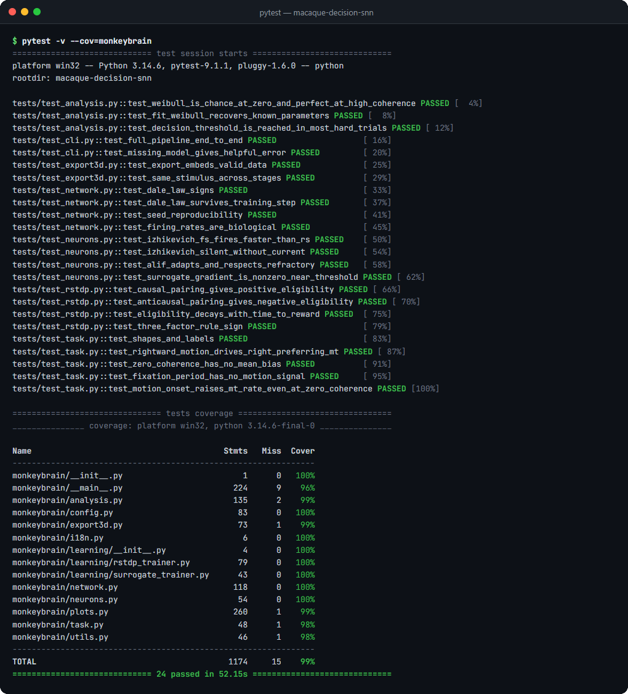
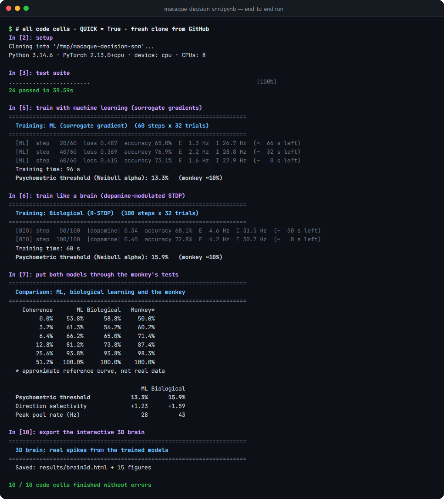

# Testing

The test suite checks the model from single equations up to the full command-line pipeline.

```bash
pip install -e ".[dev]"
pytest                          # 24 tests, ~50 s on a laptop CPU
pytest --cov=monkeybrain        # with line coverage
```

## Latest results

**24 passed · 99 % line coverage** (Windows 10, Python 3.14.6, PyTorch 2.13 CPU, 4 October 2026)

<p align="center"></p>

## What is tested

| File | What it checks |
|---|---|
| [`test_neurons.py`](tests/test_neurons.py) | Fast-spiking cells fire faster than regular-spiking ones; no input means no spikes; the adaptive LIF adapts and respects its refractory period; the surrogate gradient is non-zero and peaks at threshold |
| [`test_task.py`](tests/test_task.py) | Stimulus shapes and labels; rightward motion drives right-preferring MT neurons; 0 % coherence carries no directional bias; no motion signal during fixation; motion onset raises MT rates even at 0 % coherence |
| [`test_network.py`](tests/test_network.py) | Dale's law (E only excites, I only inhibits, no self-connections), including after an aggressive training step; identical seeds give identical spikes; untrained firing rates stay in a biological range |
| [`test_rstdp.py`](tests/test_rstdp.py) | Causal pre→post pairing gives positive eligibility and anti-causal pairing negative; eligibility decays with time to reward; the three-factor update has the sign of dopamine |
| [`test_analysis.py`](tests/test_analysis.py) | The Weibull function and its fit recover known parameters; the decision threshold is reached by at least 80 % of hard trials, and easy decisions are faster |
| [`test_export3d.py`](tests/test_export3d.py) | The 3D page embeds valid data; every training stage sees exactly the same stimulus and noise, so the only difference between stages is learning |
| [`test_cli.py`](tests/test_cli.py) | **End to end:** `neuron → simulate → train (ML and R-STDP) → evaluate → compare → brain3d` in an isolated folder with shortened training, checking every figure, metric file and the 3D export; a missing model gives a helpful error |

## End-to-end notebook run

The [Kaggle / Colab notebook](notebooks/macaque-decision-snn.ipynb) clones the repository from GitHub, runs the suite, trains both learning rules from scratch, applies the monkey's tests and exports the 3D page. Below is an excerpt of a run in quick mode (`QUICK = True`, shorter training) on a fresh clone; all 10 code cells finished without errors. Full training reaches the thresholds reported in the README (ML 9.4 %, R-STDP 15.3 %).

<p align="center"></p>

## Reproducibility

- Every random source is seeded (`--seed`, default 42). The evaluation uses a separate, fixed seed, so re-evaluating a model gives identical numbers.
- The pretrained models in [`pretrained/`](pretrained/) are the exact runs behind the figures and tables in the README.
- Every run saves its full configuration (`config.json`), training history and evaluation (`metrics.json`) next to the checkpoint.

## Continuous integration

[`.github/workflows/tests.yml`](.github/workflows/tests.yml) runs the suite with coverage on Python 3.11 and 3.12 and smoke-tests the CLI with the pretrained models. GitHub Actions runs are currently unavailable for this repository; until they resume, the results above come from a local run and from the notebook.
